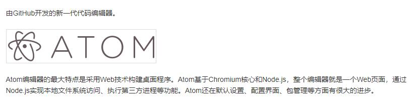

# mdOntheWay
这是一个小白从零开始学习使用markdown的过程记录。
## 一、学习markdown的理由或初衷
- 不喜欢word复杂的样式，喜欢md简洁的纯文本格式。
- 平时不断学习的过程中多少都是需要用笔记记录下知识点或是思路之内的；但全靠脑袋记住很显然不靠谱。

## 二、md编辑工具的选择
- 通过在线的markdown编辑器在线编辑，比如在Repository上新建一个*.md文件，可以在线编写md文件。
- 使用Atom编辑器编写 
官网地址：https://atom.io

## 三、Git的使用
1. 下载并安装Git
- Windows版
   - 官网网址：https://git-scm.com
   - 下载完成后一键next
   - 完成后在命令行敲下git --version 查看当前是否安装正确
