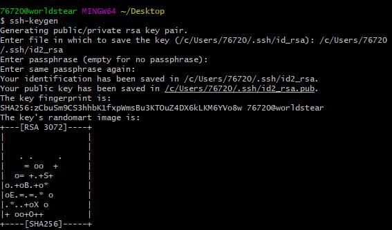

# mdOntheWay
这是一个小白从零开始学习使用markdown的过程记录。
## 一、学习markdown的理由或初衷
- 不喜欢word复杂的样式，喜欢md简洁的纯文本格式。
- 平时不断学习的过程中多少都是需要用笔记记录下知识点或是思路之内的；但全靠脑袋记住很显然不靠谱。

## 二、md编辑工具的选择
- 通过在线的markdown编辑器在线编辑，比如在Repository上新建一个*.md文件，可以在线编写md文件。
- 使用Atom编辑器编写 
官网地址：https://atom.io

## 三、Git的使用
1. 下载并安装Git
- Windows版
   - 官网网址：https://git-scm.com
   - 下载完成后一键next
   - 完成后在命令行敲下 `git --version` 查看当前是否安装正确
   - git第一次提交代码时需要配置全局的用户名和邮箱的 
   `git config --global user.name "username"` 
   `git config --global user.email "email"` 
- Linux版
   - CentOS `yum -y install git` 可以直接下载git及其依赖
   - 安装成功后使用 `git --version` 查看当前是否安装正确
   - 其他配置与Windows基本一致

2. 使用 `ssh-keygen` 生成git的ssh密钥（用于和github服务器通讯的身份验证），将自己的id_rsa.pub的公钥录入到个人的github sshkey中
- Windows版
   - 右键Git Bash Here
   - `ssh-keygen`
   - 提示保存key的位置，默认点击enter
   - Enter passphrase 可填可不填，默认enter
   - Enter same passphrase again： 默认enter 提示验证信息已经保存在C:/Users/用户/.ssh/id_rsa.pub中

   -登录github账号，在个人菜单中的【settings】->Personal settings中的【SSH and GPG keys】->【New SSH key】->填入title和key，其中key为在本地通过`ssh-keygen`命令生成的id_rsa.pub中的内容
- Linux版步骤与Windows版大致相同

3. 在github中新建一个repository(仓库)，具体通过右上角选中【New Repository】->输入必填的【Repository name】->【Create repository】
4. 将创建好的仓库的url保存下来，可以通过点击进入仓库->【Clone or download】->【Clone with SSH】->复制输入框中的地址
5. 回到本地命令行，使用`git clone git@github.com:用户名/项目名.git`命令将新建地项目克隆到本地上
6. 接下来就可以对项目进行操作，比如新建一个README.md介绍项目。
   - 使用`git add 文件名`可以将文件加入到git托管的暂存区中；
   - 使用`git commit -m "提交更新地注释"`可以将更新地文件更新到本地的版本库中
   - 使用`git push`可以将本地版本库中的代码提交到github的云端的repository
